# SceneGo

On-demand, context-aware travel assistance for overseas trips. Point the camera at a menu, sign, or ticket machine — or say what you need — SceneGo matches the scene and hands you a high-contrast local-language flash card to show a driver, cashier, or police officer.

Built with Expo / React Native. Client-only: no backend required.

## Features

- **Scene snapshot analysis** — capture a photo, cloud vision model interprets the scene (menu, signboard, station, store) and returns a structured interpretation with tips and useful phrases.
- **Multi-turn follow-up** — keep asking about the same photo (prices, allergens, directions). Conversations persist locally and can be resumed later.
- **Ready-made flash cards** — high-contrast, large-type cards for high-frequency needs (taxi by meter, allergen warnings, tax refund, SOS), with local-language TTS.
- **Realtime speech transcription** — native iOS `SFSpeechRecognizer` bridge (Expo Local Module) with live transcript banner and auto-archiving to notes.
- **Quick notes** — vouchers, Wi-Fi passwords, refund numbers; persist across launches, one-tap copy, fullscreen large-type display, and voice-memo auto-archive.
- **Session history** — past snapshot conversations are saved locally (AsyncStorage) and restorable.
- **Plugin architecture** — OCR / matcher / speech engines are pluggable:
  - Cloud OCR: OpenRouter vision models (`openrouter/free`)
  - Local matcher: keyword dictionary with Chinese/English/Thai/Japanese coverage
  - Optional on-device: Qwen2.5-0.5B (llama.rn) and Whisper-Tiny (whisper.rn)

## Screens

视觉稿由 [Pencil](https://pen.dev) 设计（`docs/reference/DESIGN-v2.1.pen`）

| | | | |
|---|---|---|---|
| 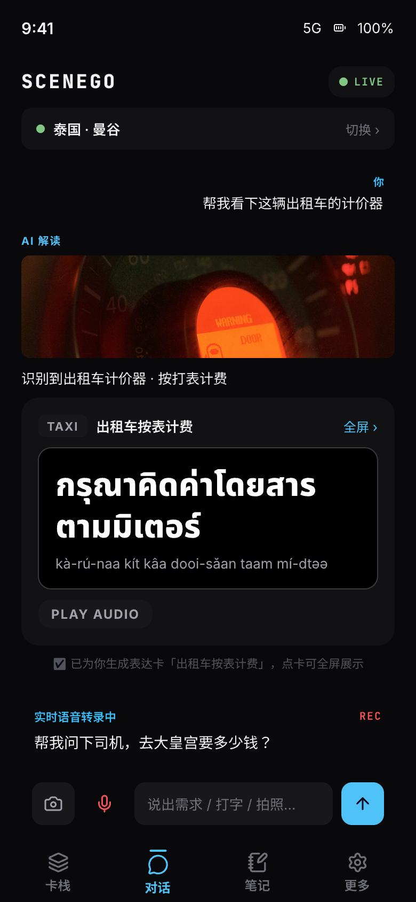 | 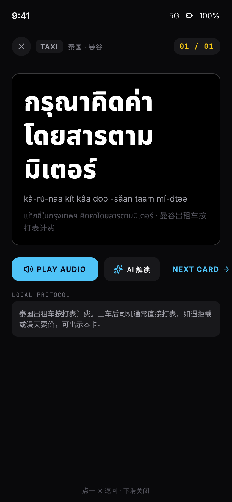 | 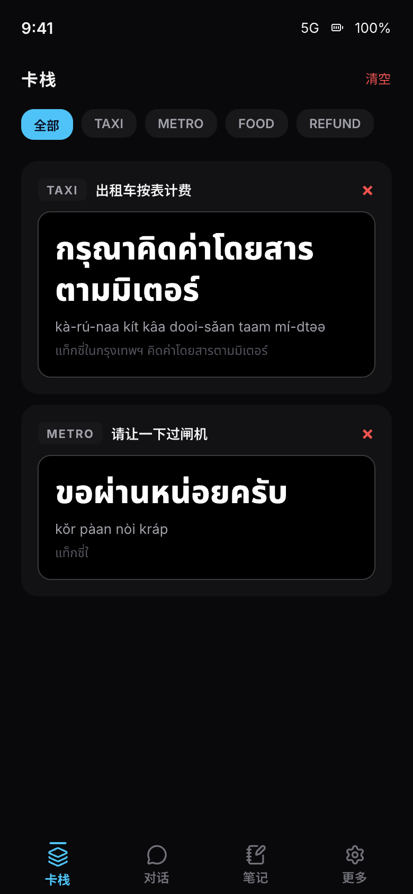 | 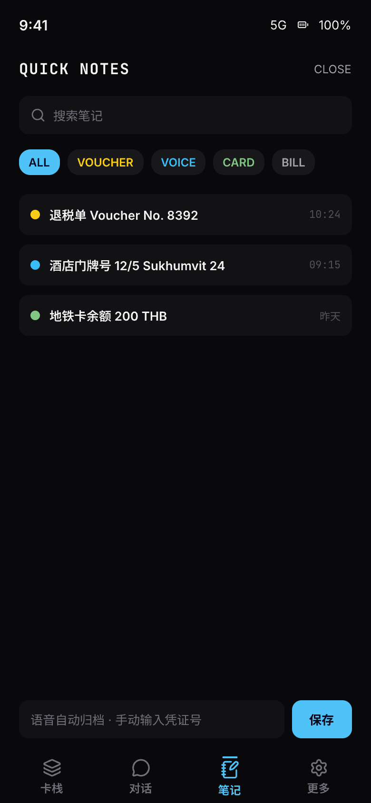 |
| 01 对话页 | 02 全屏大字卡 | 03 卡栈 | 04 笔记 |
| 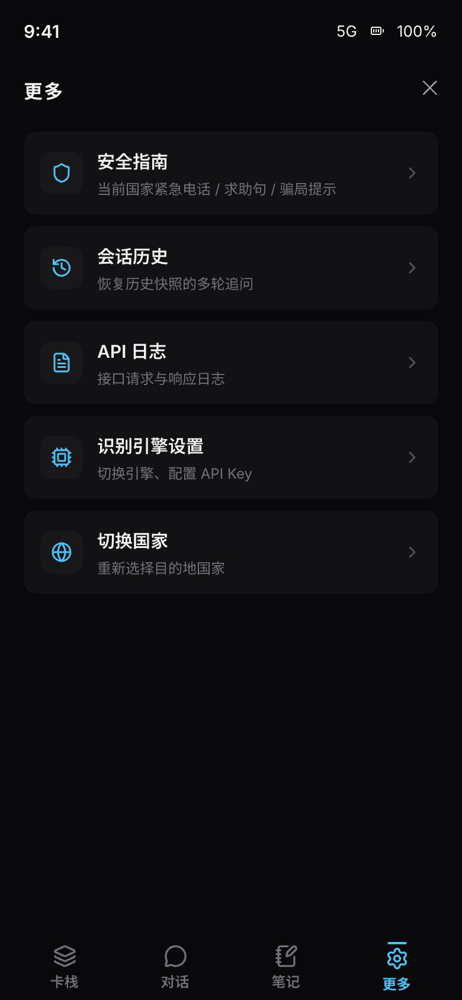 | 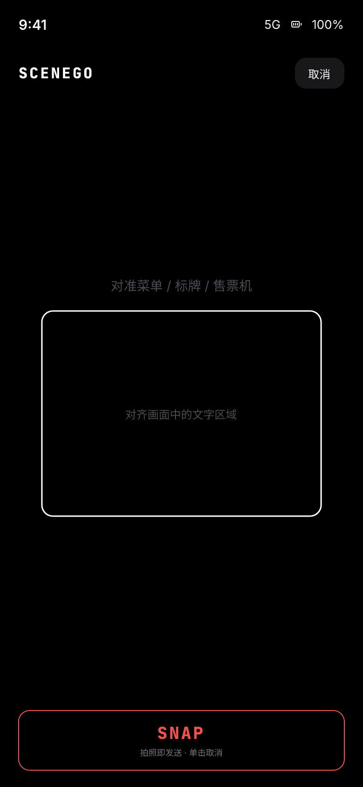 | 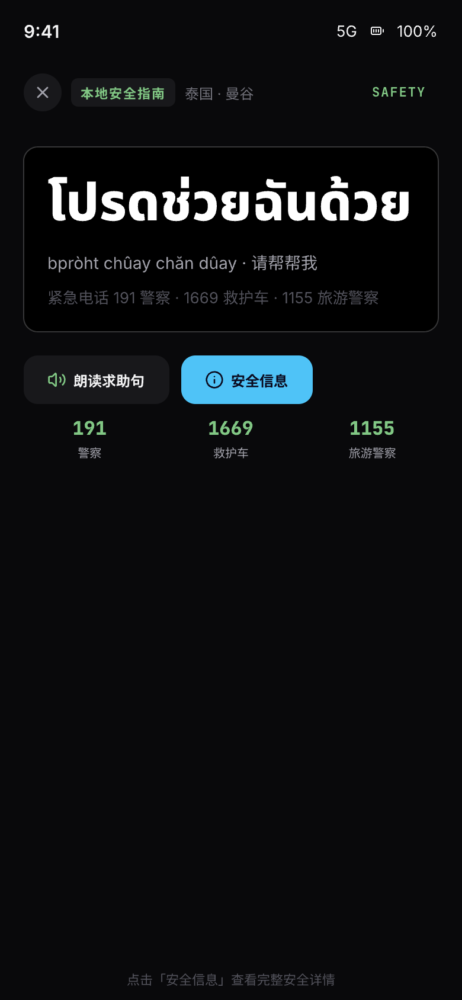 | 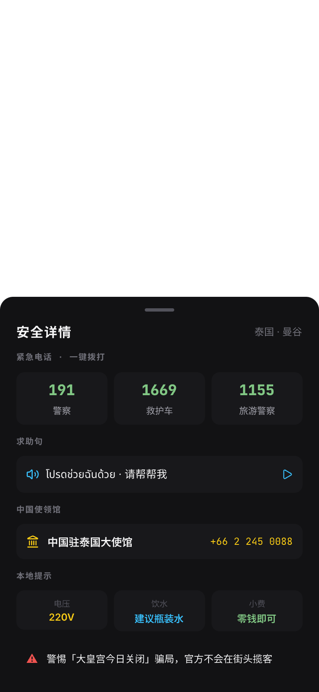 |
| 05 更多 | 06 相机取景 | 07 安全卡 | 08 安全详情 |
| 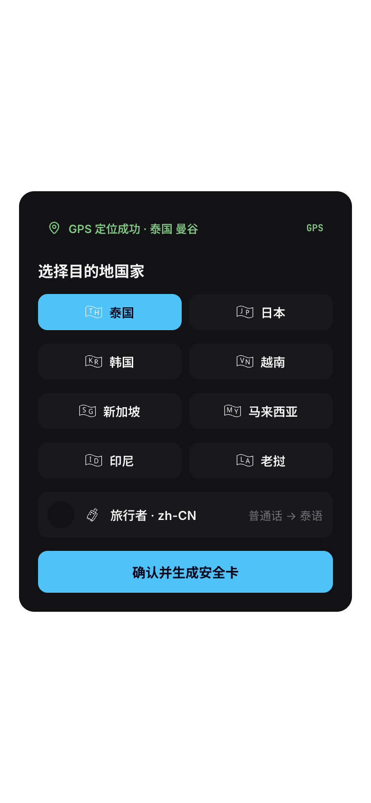 | 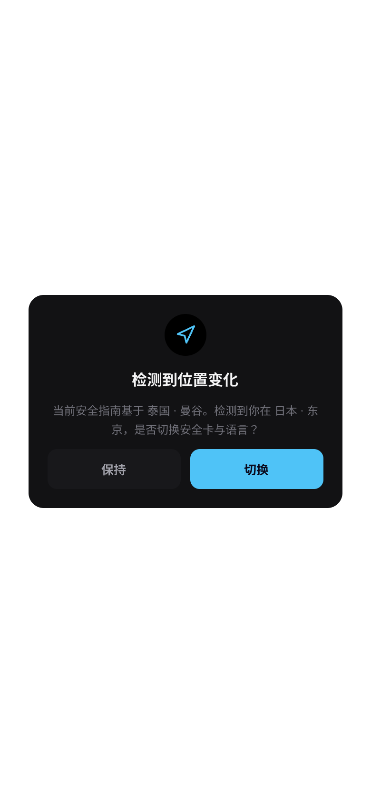 |  |  |
| 09 国家选择 | 10 位置切换 | 11 会话历史 | 12 API 日志 |
| 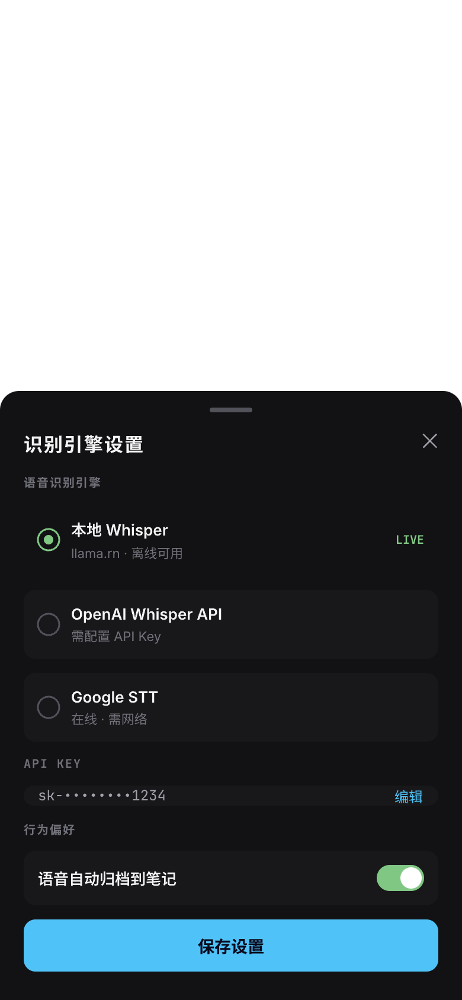 | | | |
| 13 引擎设置 | | | |

## Architecture

```
┌────────────────────────────────────────────┐
│ App (Expo / React Native)                  │
│  App.tsx                                   │
│  ├── CameraBackground ── snapshot          │
│  ├── plugins/                              │
│  │   ├── CloudVlmOcrPlugin  (OpenRouter)   │
│  │   ├── LocalDictMatcherPlugin (offline)  │
│  │   ├── QwenLocalPlugin / WhisperSpeech   │
│  │   └── PluginManager (pipeline)          │
│  ├── modules/scenego-speech (Swift,        │
│  │   SFSpeechRecognizer Local Module)      │
│  ├── utils/ SessionStore / NoteStore       │
│  │         (AsyncStorage + Keychain)       │
│  └── components/ FlashCard, Snapshot,      │
│              Notes, Logs, SessionHistory   │
└────────────────────────────────────────────┘
```

Recognition pipeline: snapshot → plugin pipeline (`recognizeText` → `match`) → structured `ScenarioResult` → flash card + follow-up chat.

## Quick Start

Requirements: Node 18+, Bun or npm, Xcode (iOS) with CocoaPods.

```bash
# install dependencies
bun install            # or: npm install

# iOS (native module autolinking, builds dev client)
npx expo run:ios

# or just Metro for Expo Go / web
npx expo start
```

### Environment variables

Create a `.env` file (`.env.example` committed as a template):

```env
# OpenRouter API key for cloud vision recognition
EXPO_PUBLIC_OPENROUTER_API_KEY=sk-or-v1-...
```

The API key is also configurable in-app (Settings → 识别引擎设置), stored in the iOS Keychain.

## Project Layout

```text
scenego/
├── App.tsx                     # Entry: app state, modals
├── app.json                    # Expo config, permissions, plugins
├── modules/
│   └── scenego-speech/         # Expo Local Module (Swift)
│       ├── expo-module.config.json
│       ├── ios/SceneGoSpeech.podspec
│       └── ios/SceneGoSpeechRecognizer.swift
├── src/
│   ├── components/             # FlashCardView, ChatPage, SnapshotDialog,
│   │                           # CardStackPage, NotesPage, MorePage, ApiLog,
│   │                           # SessionHistory, PluginSelector, CameraBackground
│   ├── plugins/                # OCR / matcher / speech plugins
│   │   ├── PluginManager.ts    # pipeline: recognize → match
│   │   └── ocr/ matchers/ speech/
│   └── utils/                  # NativeSpeech, SessionStore, NoteStore,
│                               # SecureConfig (Keychain), ApiLogger
├── ios/                        # Expo prebuild output (custom native)
├── docs/                       # PRD, architecture, strategy
└── .env.example                # env template
```

## Native Module

`SceneGoSpeechRecognizer` is an **Expo Local Module** (`modules/scenego-speech`), auto-discovered by autolinking — no manual Xcode project edits required. It bridges `SFSpeechRecognizer` + `AVAudioEngine` for realtime dictation, with locale fallback (zh-CN → zh-* → en-US) and audio-session lifecycle management.

## Tech Stack

- Expo SDK 51 / React Native 0.74 (TypeScript)
- expo-modules-core (Swift local module), expo-camera, expo-speech, expo-clipboard, expo-secure-store
- AsyncStorage (sessions & notes)
- OpenRouter chat completions API for vision

## Contributing

PRs welcome. Keep changes focused, run `npx tsc --noEmit` before submitting, and test on both simulator and a physical device where possible (speech recognition differs).

## License

MIT
