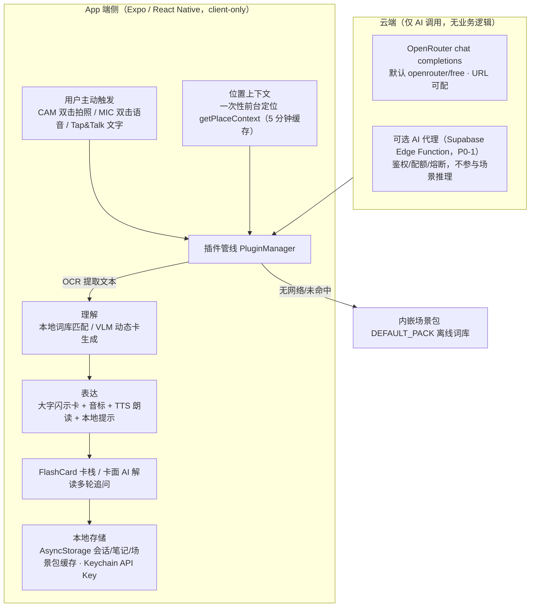

# System Architecture — SceneGo

> 更新：2026-08-03 —— 依据产品决策（**用户主动触发生成表达卡，不自动触发**）与当前代码实现重写。
> 架构形态：**纯客户端（client-only）**。云端仅承担**可选的 AI 模型调用**，不参与场景推理、不存业务数据。

## 1. 架构总览

## 2. 核心流程：触发 → 理解 → 表达

1. **触发 (Trigger) —— 用户主动，App 不自动**
   - **CAM 双击拍照**：拍照（压缩至最长边 1280px / JPEG 0.7）→ 提取信息 → **直接生成表达卡**（AI 解读降级为卡面「AI 解读」入口）
   - **MIC 双击语音**：iOS 原生听写（SFSpeechRecognizer，zh-CN 起）→ 转录文本 → 生成表达卡；Android 明确降级提示（引导拍照/文字）
   - **Tap & Talk 文字表达**：一句话需求 → 当地语言表达卡
   - **无自动触发**：无后台定位、无地理围栏、无传感器监听
2. **理解 (Understand)**
   - **位置上下文（非触发）**：`getPlaceContext()` 前台单次定位 + 逆地理编码（5 分钟缓存），用于国家切换提示（CountrySwitchPromptModal）、目标语言推断与安全卡生成；权限拒绝/失败返回 null，分析照常进行
   - **插件管线**：
     - OCR 阶段：`CloudVlmOcrPlugin`（云端 VLM）→ 结构化解读；端侧备选 `react-native-text-recognition` / `QwenLocalPlugin`（llama.rn）
     - 匹配阶段：`LocalDictMatcherPlugin` 离线关键词（读 `getPack().scenes`，远程运营可覆盖）→ 未命中兜底 `GENERAL_SCENE`；`generateCardFromText` 走 VLM 动态卡生成
3. **表达 (Express)**
   - `FlashCardView` 大字闪示卡：当地语言大字 `targetText` + 拉丁转写 `phonetic` + 补充 `subText` + 惯例提示 `localTip` + TTS 朗读
   - 卡面「AI 解读」→ `SnapshotDialogModal` 多轮追问（会话持久化，可恢复）

## 3. 数据与存储

| 数据 | 存储 | 说明 |
|---|---|---|
| 会话历史 / 快速笔记 | AsyncStorage | SessionStore / NoteStore |
| 场景包缓存 | AsyncStorage | `@scenego/scene-pack`；加载优先级：远程 → 缓存 → 内嵌 DEFAULT_PACK |
| API Key | iOS Keychain | SecureConfig，可应用内配置 |

## 4. 云端角色（边界）

- 云端**只**提供 AI 模型调用（OpenRouter chat completions，默认 `openrouter/free`）；不做场景推理、不做规则引擎、不存业务数据
- 网关地址可配（`AI_GATEWAY_URL` / `EXPO_PUBLIC_AI_GATEWAY_URL`）；P0-1 Supabase Edge Function 代理（鉴权/配额/熔断）就绪后仅需改 URL，客户端其余逻辑不变
- 离线兜底：内嵌场景包词库 + 端侧模型（llama.rn / whisper.rn），无网可用核心表达
