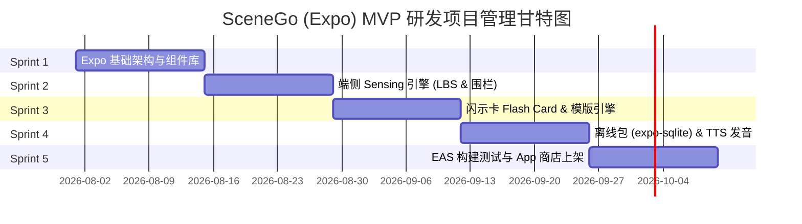

# SceneGo — Expo (React Native) 项目管理与技术落地规划

> **重要更新（2026-08-03）**：产品决策改为**用户主动触发生成表达卡**（不做自动触发/地理围栏/传感器感知）。技术选型表已按实际实现修订；下方 Sprint 甘特图与任务拆解为初版规划（2026-07），Sprint 2「智能场景感知引擎」已取消。

## 1. 技术选型与 Expo 模块生态 (Expo Ecosystem Setup)

SceneGo 采用 **Expo (React Native)** 作为跨端移动前端开发框架，兼顾 iOS / Android 的高帧率动画与低功耗端侧感知能力。

### 核心 Expo 模块依赖表 (Core Expo Dependencies)

| 功能模块 | Expo / RN 依赖库 | 作用与技术实施细则 |
| :--- | :--- | :--- |
| **页面与导航** | 自定义状态驱动 Modal 栈（`App.tsx`） | 单页应用 + 全屏 Modal（大字卡/相机取景/弹窗），无路由库依赖 |
| **位置上下文（一次性）** | `expo-location` | 前台单次定位 + 逆地理编码（`getPlaceContext`，5 分钟缓存），用于国家/语言/安全卡；不监听、不自动触发 |
| **大字卡高亮闪示** | `expo-keep-awake` | 调出 Flash Card 大字卡时强行保持屏幕常亮与最高亮度提升 |
| **本地语音发音** | `expo-speech` | 支持系统级离线 TTS 朗读当地语言（泰语、日语、英语等） |
| **相机输入** | `expo-camera` | 取景与拍照（双击 SNAP 成卡），模拟器自动降级测试快照 |
| **图片压缩** | `expo-image-manipulator` | 上传前压缩（最长边 1280px / JPEG 0.7） |
| **文本识别** | `react-native-text-recognition` | 端侧 OCR 备选路径 |
| **端侧模型（可选）** | `llama.rn` / `whisper.rn` | 本地 Qwen2.5-0.5B 匹配 / Whisper-Tiny 转写，离线兜底 |
| **本地存储** | AsyncStorage + `expo-secure-store` | 会话/笔记/场景包缓存；API Key 存 iOS Keychain |
| **构建与热更新** | `eas-build` / `eas-update` | 使用 EAS CI/CD 流水线实现云端打包与场景卡/防坑规则 OTA 热更新 |

---

## 2. 项目管理与 Sprint 迭代计划 (Sprint Planning & Delivery)

项目采用 **2 周为 1 个 Sprint** 的敏捷迭代模式，整体分为 5 个 Sprint（共 10 周）实现 MVP 稳定上线。

### 📋 Sprint 任务拆解与交付物 (Work Breakdown Structure)

#### 🔷 Sprint 1: 基础架构搭建 (Expo Framework & Design System)
*   **任务**：
    *   初始化 `expo-router` 项目架构（TypeScript + Tailwind / NativeWind）。
    *   构建高对比度暗黑/极简设计系统（支持 48pt+ 超大字体展示组件）。
    *   配置 Zustand / Redux Toolkit 状态管理（当前场景、全屏闪示状态、用户语言偏好）。
*   **交付物**：可运行的 App 框架与静态大字闪示卡 Demo。

#### 🔷 Sprint 2: 智能场景感知引擎 (Sensing & Geofencing) —— 已取消
*   **取消原因（2026-08-03 产品决策）**：不做自动触发生成卡片。自动感知依赖 geofence 精度、后台耗电且 AI 成本不可预期；用户主动触发更可控、更精准、成本可预期。
*   **实际替代**：主动触发管线（CAM 双击拍照 / MIC 语音 / 文字 → 本地词库匹配 + VLM 动态卡生成）已随 Sprint 3 交付。

#### 🔷 Sprint 3: 闪示卡与多语言表达系统 (Flash Card & Template Engine)
*   **任务**：
    *   开发全屏 Flash Card 模版组件：含泰语/日语大字、罗马音标注、中文释义、语音播放控制。
    *   实现场景卡变量插值（如：自动填入酒店本地名称、菜品忌口偏好）。
    *   开发 Local Protocol 浮窗组件（小费计算、计费规则、防止绕路提示）。
*   **交付物**：泰国曼谷与日本东京 20+ 高频场景表达卡交互全通。

#### 🔷 Sprint 4: 离线数据库与语音发音引擎 (Offline Resiliency & TTS)
*   **任务**：
    *   集成 `expo-sqlite`，设计 Scene / Card / Rule 的本地数据库 Schema 与预置数据迁移。
    *   集成 `expo-speech`，实现离线状态下播放泰语/日语语音能力。
    *   无网络断网兜底测试（飞行模式下场景感知与卡片渲染全可用）。
*   **交付物**：零依赖离线包与离线语音朗读体验。

#### 🔷 Sprint 5: 性能调优、EAS 云打包与上架 (Testing, EAS & Launch)
*   **任务**：
    *   使用 `eas-build` 构建 iOS (.ipa) 与 Android (.aab) 安装包。
    *   配置 `eas-update` 接入 OTA 热更新，支持无缝推送新的场景卡与避坑规则。
    *   进行真机耗电与发热测试（相机取景、语音转写、定位场景）。
    *   App Store & Google Play 开发者账号配置与提交审核。
*   **交付物**：正式发布 MVP 版本。

---

## 3. 研发质量保证与风险控制 (Quality & Risk Control)

1.  **AI 网络依赖与成本控制 (Network & AI Cost)**：
    *   *策略*：核心表达离线可用（内嵌场景包词库 + 端侧模型兜底）；AI 调用走可配网关（P0-1 代理：配额/熔断），未配置 Key 时纯本地匹配不中断。
2.  **离线体验保证 (Zero-Network Policy)**：
    *   *策略*：离线场景词库与大字卡模版通过 `expo-sqlite` 预置于 App 包内，所有核心渲染逻辑 100% 不依赖网络 API。
3.  **场景误归类防范 (Misclassification Prevention)**：
    *   *策略*：双引擎互检（本地词库 + VLM），未命中兜底通用卡；卡面提供「AI 解读」多轮追问人工纠错；后续埋点（P1-8）度量场景识别精准率（OMTM）。
