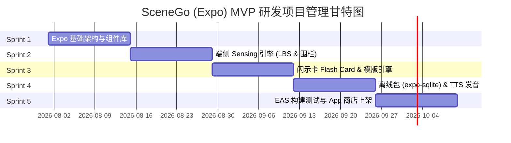

# SceneGo — Expo (React Native) 项目管理与技术落地规划

## 1. 技术选型与 Expo 模块生态 (Expo Ecosystem Setup)

SceneGo 采用 **Expo (React Native)** 作为跨端移动前端开发框架，兼顾 iOS / Android 的高帧率动画与低功耗端侧感知能力。

### 核心 Expo 模块依赖表 (Core Expo Dependencies)

| 功能模块 | Expo / RN 依赖库 | 作用与技术实施细则 |
| :--- | :--- | :--- |
| **路由与导航** | `expo-router` | 基于文件系统的极速路由，支持全屏 Modal (大字卡闪示) 与 Stack 切换 |
| **地理围栏与位置** | `expo-location` | 提供后台位置跟踪 (`startLocationUpdatesAsync`) 与低功耗 Geofence 监听 |
| **运动传感器** | `expo-sensors` | 读取 Accelerometer / Gyroscope 辅助判断静止、步行、乘车状态 |
| **大字卡高亮闪示** | `expo-keep-awake` | 调出 Flash Card 大字卡时强行保持屏幕常亮与最高亮度提升 |
| **本地语音发音** | `expo-speech` | 支持系统级离线 TTS 朗读当地语言（泰语、日语、英语等） |
| **离线数据库** | `expo-sqlite` | 存储离线场景词库、小费规则图谱与闪示卡模版（无网可用） |
| **高性能 UI / 动画** | `react-native-reanimated` | 0.1s 极速切出高对比度大字闪示卡弹窗，支持流畅滑动手势 |
| **构建与热更新** | `eas-build` / `eas-update` | 使用 EAS CI/CD 流水线实现云端打包与场景卡/防坑规则 OTA 热更新 |

---

## 2. 项目管理与 Sprint 迭代计划 (Sprint Planning & Delivery)

项目采用 **2 周为 1 个 Sprint** 的敏捷迭代模式，整体分为 5 个 Sprint（共 10 周）实现 MVP 稳定上线。

### 📋 Sprint 任务拆解与交付物 (Work Breakdown Structure)

#### 🔷 Sprint 1: 基础架构搭建 (Expo Framework & Design System)
*   **任务**：
    *   初始化 `expo-router` 项目架构（TypeScript + Tailwind / NativeWind）。
    *   构建高对比度暗黑/极简设计系统（支持 48pt+ 超大字体展示组件）。
    *   配置 Zustand / Redux Toolkit 状态管理（当前场景、全屏闪示状态、用户语言偏好）。
*   **交付物**：可运行的 App 框架与静态大字闪示卡 Demo。

#### 🔷 Sprint 2: 智能场景感知引擎 (Sensing & Geofencing)
*   **任务**：
    *   集成 `expo-location`，实现后台低功耗地理围栏监听 (Bangkok / Tokyo 热门机场/车站围栏)。
    *   结合 `expo-sensors` 的速度与加速度判断逻辑（静止/步行/车速识别）。
    *   编写场景推理适配器：识别当前是在机场打车、餐厅点餐还是退税柜台。
*   **交付物**：移动端可精准触发 `AIRPORT_TAXI` / `DINING_ORDER` 等场景事件流。

#### 🔷 Sprint 3: 闪示卡与多语言表达系统 (Flash Card & Template Engine)
*   **任务**：
    *   开发全屏 Flash Card 模版组件：含泰语/日语大字、罗马音标注、中文释义、语音播放控制。
    *   实现场景卡变量插值（如：自动填入酒店本地名称、菜品忌口偏好）。
    *   开发 Local Protocol 浮窗组件（小费计算、计费规则、防止绕路提示）。
*   **交付物**：泰国曼谷与日本东京 20+ 高频场景表达卡交互全通。

#### 🔷 Sprint 4: 离线数据库与语音发音引擎 (Offline Resiliency & TTS)
*   **任务**：
    *   集成 `expo-sqlite`，设计 Scene / Card / Rule 的本地数据库 Schema 与预置数据迁移。
    *   集成 `expo-speech`，实现离线状态下播放泰语/日语语音能力。
    *   无网络断网兜底测试（飞行模式下场景感知与卡片渲染全可用）。
*   **交付物**：零依赖离线包与离线语音朗读体验。

#### 🔷 Sprint 5: 性能调优、EAS 云打包与上架 (Testing, EAS & Launch)
*   **任务**：
    *   使用 `eas-build` 构建 iOS (.ipa) 与 Android (.aab) 安装包。
    *   配置 `eas-update` 接入 OTA 热更新，支持无缝推送新的场景卡与避坑规则。
    *   进行真实手机续航与耗电量测试（确保后台 Geofence 不异常耗电）。
    *   App Store & Google Play 开发者账号配置与提交审核。
*   **交付物**：正式发布 MVP 版本。

---

## 3. 研发质量保证与风险控制 (Quality & Risk Control)

1.  **后台功耗风险控制 (Battery & Background Throttling)**：
    *   *策略*：iOS/Android 对后台 GPS 非常敏感。避免使用持续高精度 GPS，优先使用基于 Cell ID / WiFi 的 Geofence 监听；只有进入目标围栏后才开启最高精度定位。
2.  **离线体验保证 (Zero-Network Policy)**：
    *   *策略*：离线场景词库与大字卡模版通过 `expo-sqlite` 预置于 App 包内，所有核心渲染逻辑 100% 不依赖网络 API。
3.  **场景触发误报防范 (False Positive Prevention)**：
    *   *策略*：增加运动状态与时间窗条件校验（例如：仅当在机场且速度 $<5\text{km/h}$ 停留时间 $>60$ 秒才触发打车卡），避免快速通过时不必要切屏。
