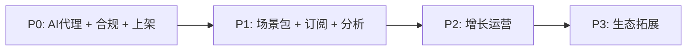

# 运营能力建设路线图 (Operations Roadmap)

> 状态：长期规划（Active）
> 更新：2026-08-03
> 目标：让 SceneGo 从"可运行的 MVP"演进为"可直接下场运营的产品"——可上架、可监控、可迭代内容、可收费、可增长。

---

## 1. 背景：现状与运营差距

SceneGo 当前为 client-only 架构（无后端、无账号、内容硬编码）。对照"下场运营"的要求，存在四个硬缺口：

| 现状 | 运营含义 | 缺口等级 |
|---|---|---|
| OpenRouter key 通过 `EXPO_PUBLIC_` 打进客户端 JS bundle | 公开上架后任何人可提取，AI 成本被盗刷失控 | 安全事故级 |
| 全本地存储，无账号、无后端 | 无用户概念，无法计量北极星指标、无法控额度防滥用 | 运营不可行 |
| 词库/场景卡/本地规则硬编码 | 改一个词 = 发版 + 审核 1-3 天，内容运营节奏归零 | 运营不可行 |
| 仅 Sentry 崩溃监控 | WSSE、场景触发精度、AI 成本均不可见 | 运营瞎 |
| 无 IAP / 订阅 | 商业化路径（Day Pass $2.99 / Weekly Pro $9.99）未落地 | 收入为零 |
| 语音模块 iOS only（SFSpeechRecognizer） | 东南亚主力机型为 Android，运营范围锁死一半 | 范围受限 |

**核心判断**：SceneGo 的差异化是"场景推理 + 大字卡 + 本地规则"的内容体系，而内容体系必须可远程运营。因此**场景包体系是本路线图的枢纽**：它决定了内容迭代不需要发版。

---

## 2. 北极星与运营指标

- **North Star**：周活跃场景表达成功次数（WSSE，Weekly Successful Scenario Expressions）
- **OMTM**：场景自动触发精准率 > 90%
- **配套监控**：AI 单次识别成本、卡渲染耗时（p95）、订阅转化率、免费→付费漏斗

所有 P1 及以后的埋点必须能支撑上述指标的计算。

---

## 3. 分层规划

### P0 上线安全网（1-2 周）—— 不完成不可公开上架

| # | 能力 | 交付物 | 验收标准 |
|---|---|---|---|
| 1 | **AI 代理层** | Supabase Edge Function 代理 OpenRouter；key 仅存服务端环境变量 | 客户端无任何 key；按用户配额 + 速率限制 + 熔断生效；成本按用户可核算 |
| 2 | **合规三件套** | 隐私政策、用户协议、数据清单（App 内页 + 官网同源） | 审核可提交；页面可访问 |
| 3 | **上架链路** | eas build/submit 自动化、TestFlight 内测分发 | 一键出 TestFlight 包 |
| 4 | **监控补全** | Sentry breadcrumbs + 性能事务 | 识别/渲染耗时可见 |

### P1 运营闭环（3-6 周）—— "下场"的真正起点

| # | 能力 | 交付物 | 验收标准 |
|---|---|---|---|
| 5 | **匿名账号体系** | 设备 ID → 云端用户（token 鉴权，不做密码登录） | 新设备自动注册；AI 配额按用户生效 |
| 6 | **场景包体系（枢纽）** | 场景卡/词库/本地规则抽为版本化场景包（城市 × 语言 × 场景）；远程下发 + 本地缓存 + 增量更新；运营后台（极简 Web 或 JSON 仓库 + CI 校验） | 新增城市/修正词条**不发版**即可生效；旧包可回滚 |
| 7 | **订阅商业化** | iOS IAP（Day Pass / Weekly Pro）+ 服务端 receipt 验证 + 权益门控 | 订阅可购、可恢复、可退款感知；绕过验证无法解锁 |
| 8 | **行为分析** | 事件埋点：WSSE、场景触发精度、卡片使用率、AI 单次成本（自建 event 表或 PostHog） | 北极星指标可每日导出 |

### P2 增长运营（2-3 月）

| # | 能力 | 说明 |
|---|---|---|
| 9 | 分享/邀请 | 大字卡一键生成图片分享；邀请码/链接 |
| 10 | 落地页 + ASO | 官网（兼隐私政策宿主）、关键词、商店截图 |
| 11 | 免费/付费分层 | 每日免费 N 次 AI 识别 → 订阅解锁无限 |
| 12 | 城市内容 SOP | 曼谷 → 东京 → 首尔/新加坡；每城一套（打车/餐饮/退税/地铁/SOS + 本地规则），周更节奏 |

### P3 生态拓展（季度+）

| # | 能力 | 说明 |
|---|---|---|
| 13 | eSIM 场景返佣 | 机场卡内嵌流量卡推荐（战略既定商业化路径） |
| 14 | 用户自定义场景卡（UGC） | 开放卡片模板 |
| 15 | 离线场景包下载 + 20+ 语言 | 离线可用是核心价值主张 |

---

## 4. 依赖关系

- **P0-1（AI 代理）是 P1-7（订阅）的前置**：配额、熔断、成本核算都依赖服务端代理
- **P1-6（场景包）必须先于内容运营**：否则任何词库/规则改动都卡在发版审核
- **P1-5（账号）是 P1-7/P1-8 的前置**：配额与埋点需要用户身份

## 5. 里程碑

| 里程碑 | 时间 | 目标 | 出口条件 |
|---|---|---|---|
| M1 | 2 周 | TestFlight 小范围内测 | P0 全部完成 |
| M2 | 6 周 | 公开上架 + 订阅可购 + 场景包远程运营 | P1 全部完成 |
| M3 | 10 周 | 增长动作可执行 | P2-9/10/11 完成 |
| M4 | 季度+ | 生态与多语言 | P3 按优先级推进 |

## 6. 技术选型（独立开发者导向）

| 需求 | 选型 | 理由 |
|---|---|---|
| 后端一条龙 | **Supabase**（Postgres + Auth + Edge Functions + Storage） | 一个平台覆盖账号/AI 代理/场景包/事件表；免费档够起步；避免自建后端运维 |
| 分析 | 自建 event 表（Supabase）或 PostHog 免费档 | 起步低成本，数据自有 |
| 支付 | iOS StoreKit（强制 IAP）+ App Store Server API；Android Google Play Billing | 平台审核要求，无替代 |
| 场景包存储 | Supabase Storage + JSON Schema 版本化 | 客户端按版本 diff 更新 |

## 7. 风险与对策

| 风险 | 等级 | 对策 |
|---|---|---|
| 客户端内置 AI key 未代理即上架 | 高 | P0-1 为上架前置门槛，纳入 PR 检查（AGENTS.md 约定禁止新增 `EXPO_PUBLIC_*AI*KEY`） |
| 订阅不做服务端验证 | 高 | P1-7 明确服务端 receipt 验证为验收标准 |
| 单点依赖 OpenRouter | 中 | 已有本地匹配器 fallback；代理层加熔断 + 降级策略 |
| 内容运营依赖发版 | 中 | 场景包体系（P1-6）为枢纽，优先级高于一切内容工作 |
| Android 语音能力缺失 | 中 | 列入 P2，作为城市扩展的前置评估项 |

## 8. 落地原则

- 每项能力有明确验收标准（见上表），完成 = 验收通过，不设模糊的"推进中"
- 工程改动一律走 Git Flow（见 `AGENTS.md`）：feature 分支 → PR → develop，CI 门禁
- 费用类能力（AI 代理、订阅）必须先有成本核算埋点再上线
