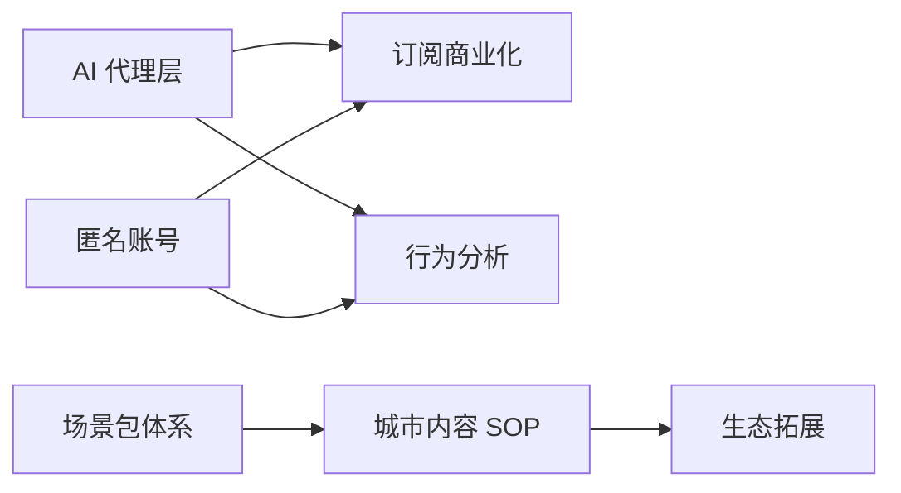

# DEPENDENCIES-01 · SceneGo 依赖关系总表

> 所有能力之间的**前置依赖关系**的唯一事实来源。
> 状态变更（某依赖完成）仍以 `../ROADMAP-01.md` 为准，本文件只描述依赖结构，不写进度。

## 依赖图

## 依赖明细

| 依赖方 | 前置依赖 | 原因 |
|---|---|---|
| 订阅商业化（P1） | **AI 代理层（P0）** | 配额、熔断、成本核算都依赖服务端代理 |
| 行为分析（P1） | **AI 代理层（P0）** | 需要服务端鉴权与配额体系支撑埋点 |
| 城市内容 SOP（P2） | **场景包体系（P1）** | 否则任何词库/规则改动都卡在发版审核 |
| 订阅商业化（P1） | **匿名账号（P1）** | 权益门控需要用户身份 |
| 行为分析（P1） | **匿名账号（P1）** | 配额与指标计算需要用户身份 |
| 生态拓展（P3） | 城市内容 SOP（P2） | 内容体系是生态合作的基础 |

## 无依赖的能力（可并行推进）

- 合规三件套 ✅（已完成）
- 上架链路（eas build/submit）
- 监控补全（崩溃/性能埋点）
- Android 语音
- 4 大实用度突破（PRD §3.1，纯客户端改造，不依赖云端）

## 维护规则

1. 新增能力时：评估前置依赖 → 在本表登记
2. 依赖被打破/新增：更新本表 + 依赖图
3. 完成状态一律查 `../ROADMAP-01.md`，本文件不写进度
